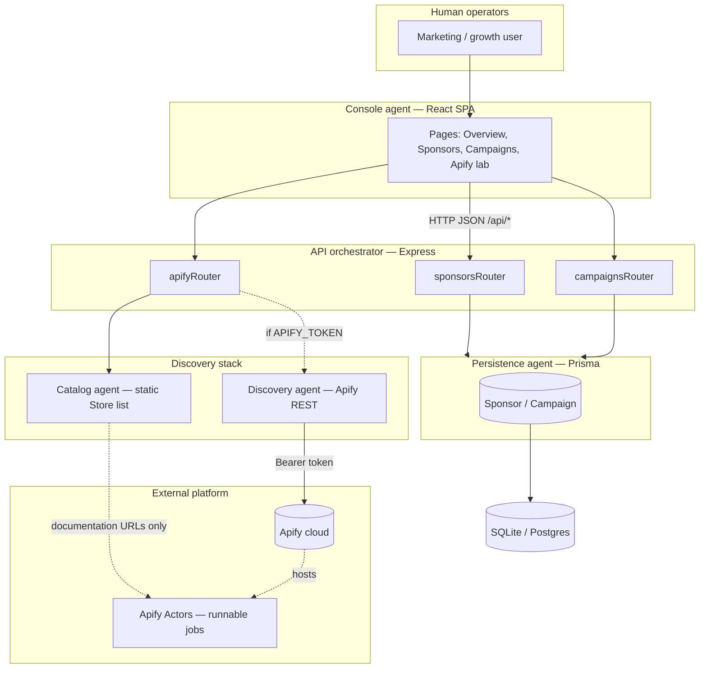
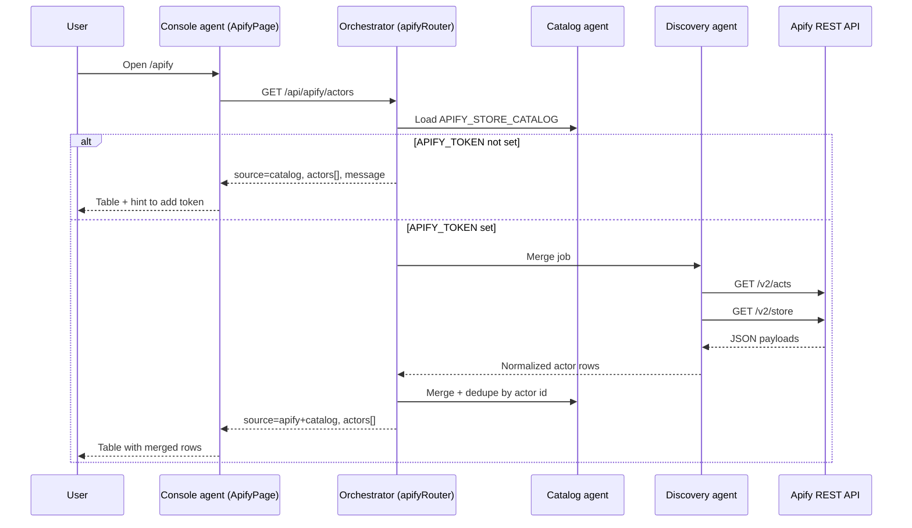

# Agents — roles, workflow, and architecture

This document describes **agents** in the marketing platform: both **logical agents** (software roles inside our stack) and **external automation agents** (Apify Actors). Diagrams use [Mermaid](https://mermaid.js.org/) (renders on GitHub and many Markdown viewers).

## 1. Agent taxonomy

| Agent | Type | Responsibility |
| --- | --- | --- |
| **Console agent** | Logical / UI | Presents sponsors, campaigns, and Apify discovery to humans (`client/` SPA). |
| **API orchestrator** | Logical / backend | Routes HTTP, validates input, merges data sources (`server/src/index.ts`, routers). |
| **Persistence agent** | Logical / data | Reads and writes sponsors and campaigns via Prisma (`server/src/lib/prisma.ts`). |
| **Catalog agent** | Logical / integration | Supplies the static Apify Store reference list (`APIFY_STORE_CATALOG` in `server/src/routes/apify.ts`). |
| **Discovery agent** | Logical / integration | Optionally calls Apify REST APIs when `APIFY_TOKEN` is set; deduplicates with catalog. |
| **Apify Actor** | External | Hosted automation on Apify’s platform (scrapers, crawlers); **not executed** by this repo—only listed and linked for planning. |

Sponsors flagged with **`fundsApifyLab`** in the database indicate commercial support for experimenting with Apify Actors against campaign needs.

---

## 2. Architecture — agents and boundaries

High-level view: who talks to whom and where automation lives outside this codebase.



**Reading the diagram**

- **Solid arrows**: request/response paths implemented in this repository.
- **Dotted arrows**: optional token-based calls to Apify, or conceptual links (catalog URLs point at Store pages; runtimes live on Apify).

---

## 3. Architecture — deployment view

Same agents, emphasizing runtime processes and ports for local development.

```mermaid
flowchart LR
  subgraph DevMachine["Developer machine"]
    V[Vite :5173\nConsole agent]
    E[Express :4000\nOrchestrator + routers]
    DBF[(dev.db)\nPersistence]
  end

  subgraph Optional["Optional cloud"]
    AP[api.apify.com\nDiscovery agent target]
  end

  V -->|proxy /api| E
  E --> DBF
  E -.->|HTTPS| AP
```

---

## 4. Workflow — Apify actor discovery (end-to-end)

Sequence when a user opens **Apify lab** and the backend resolves the actor list.



---

## 5. Workflow — sponsor-funded “agent experiments” (conceptual)

This flow is **not** implemented as an automated runner in code; it describes how teams typically use the console plus Apify **after** discovery.

```mermaid
flowchart TD
  A[Identify campaign need\n(e.g. competitor pricing)] --> B{Sponsor funds\nApify lab?}
  B -->|Yes — fundsApifyLab| C[Pick Actor from\ndiscovery list]
  B -->|No| D[Organic / other tools]
  C --> E[Run Actor on Apify\n(console.apify.com)]
  E --> F[Export results to\nanalytics / CRM]
  F --> G[Update campaign status\nin console]
```

The platform’s role is to **record** sponsorship (`fundsApifyLab`), **plan** actors (discovery endpoint), and **track** campaigns—not to schedule Apify runs.

---

## 6. Relationship to other documents

| Document | Complement |
| --- | --- |
| [ARCHITECTURE.md](ARCHITECTURE.md) | System-wide use cases and data store. |
| [WORKFLOWS.md](WORKFLOWS.md) | Step-by-step business flows without agent vocabulary. |
| [SPONSORS_AND_APIFY.md](SPONSORS_AND_APIFY.md) | Actor table and API endpoints on Apify’s side. |

---

## 7. Future extensions (optional)

If you later add **first-class scheduling** (this repo invoking Actors via Apify API), introduce a **Runner agent** service with queues, secrets, and idempotent run IDs—keeping the Console agent read-only for operators except “start run” actions.
