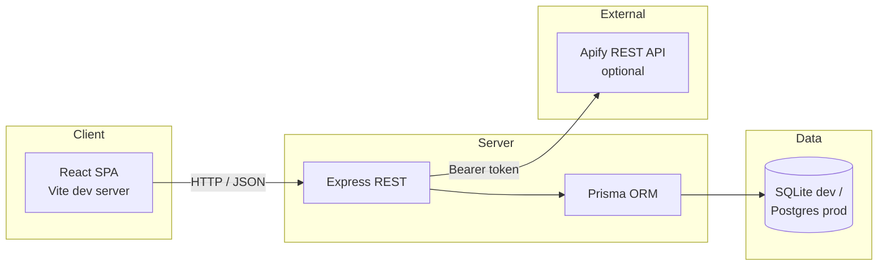

# Architecture

## Goal

Deliver a **marketing operations console**: list **sponsors** by tier and optional **Apify lab** funding, attach **campaigns** with budgets and lifecycle status, and surface **Apify Store** actors (plus account actors when `APIFY_TOKEN` is configured).

No separate requirement document was present in the workspace; behavior matches the shipped code and companion docs (`WORKFLOWS.md`, `DATABASE.md`, `SPONSORS_AND_APIFY.md`, `AGENTS.md`).

## Logical architecture

## Use cases

| ID | Actor | Goal | Outcome |
| --- | --- | --- | --- |
| UC1 | Ops user | See sponsor tiers and linked campaign counts | `GET /api/sponsors` |
| UC2 | Ops user | Track campaigns and budgets | `GET /api/campaigns` |
| UC3 | Growth engineer | Inspect Apify actors for scraping experiments | `GET /api/apify/actors` |
| UC4 | Integrator | Register a new sponsor programmatically | `POST /api/sponsors` |
| UC5 | Integrator | Create a draft campaign tied to a sponsor | `POST /api/campaigns` |
| UC6 | DevOps | Health check for uptime monitors | `GET /api/health` |

## Quality attributes

- **Simplicity**: single-process API, SQLite file for frictionless demos.
- **Deployability**: Prisma datasource can target Postgres (Neon / Supabase) — see `DATABASE.md`.
- **Transparency**: sponsorship of Apify-heavy work is modeled with `fundsApifyLab` on `Sponsor`.

## Non-goals (this demo)

- Authentication and authorization beyond public read APIs.
- Running Apify actors from this repo (only discovery / listing helpers).
